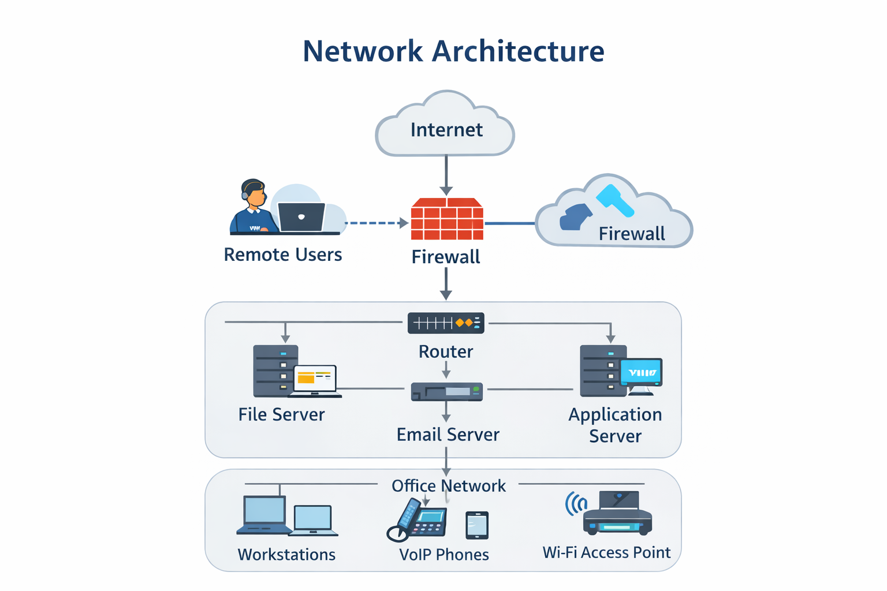
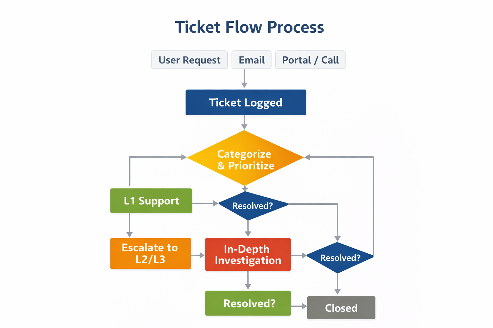

# IT Support Knowledge Base

## 📘 Overview
This repository contains structured documentation, workflows, templates, and diagrams for IT support operations.  
It is designed to demonstrate best practices in **IT service management, support delivery, and systems administration**.

---

## 🧩 Areas Covered

### 🔹 Service Desk Operations
- Ticket handling workflows
- Incident management
- Escalation procedures
- SLA management

### 🔹 User Support
- Onboarding procedures
- Offboarding processes
- Account provisioning
- Access control

### 🔹 Infrastructure Support
- Network troubleshooting
- Endpoint management
- Asset management
- Backup and recovery

---

## 📂 Repository Structure

---

## 📑 Documentation

- 📄 [Onboarding Guide](docs/onboarding.md)
- 📄 [Troubleshooting Manual](docs/troubleshooting.md)
- 📄 [Incident Management](docs/incident-management.md)
- 📄 [Service Desk Guide](docs/service-desk.md)
- 📄 [Asset Management](docs/asset-management.md)

---

## 📊 Diagrams

  
  

---

## 🧾 Templates

- 📝 Incident Report Template  
- 📝 Change Request Form  
- 📝 User Onboarding Form  

---

## 🎯 Purpose
This repository serves as:
- A **professional IT portfolio**
- A **knowledge base for IT teams**
- A **reference model for service desk operations**
- Evidence of **IT governance & documentation skills**

---

## 👤 Author
**Hezron Mutua Peter**  
IT Support Specialist | Systems Administrator | Service Desk Operations  
📍 Mombasa, Kenya

